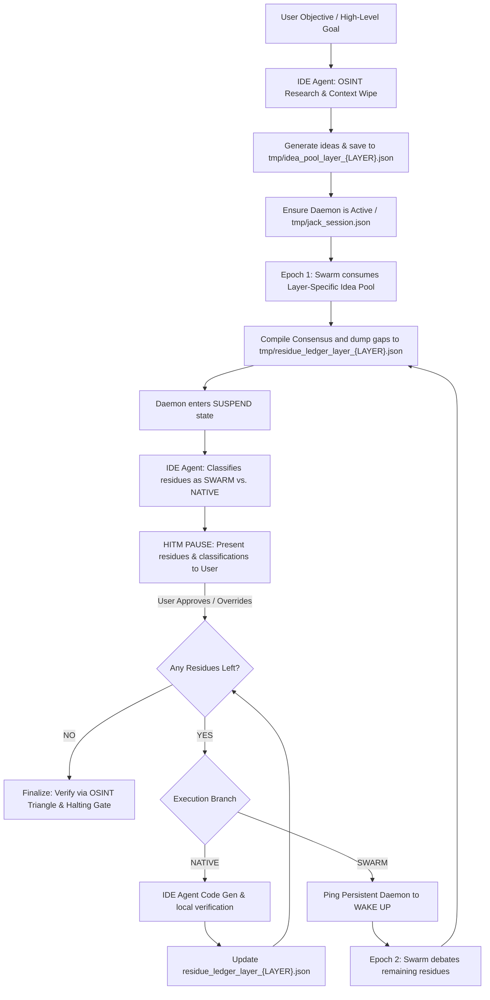

# Jack Engine: AI Agent Playbook & Operational Manual (v4.1 — Rolling Horizon & Re-Hydration Spec)

> [!IMPORTANT]
> **This is the official, binding operational playbook for all IDE AI Agents interacting with the Jack Engine.**  
> Before executing any CLI swarm layers, modifying codebases, or writing files, you must ingest this manual completely. You are 100% accountable for the integrity, validity, and mathematical truth of any filesystem modifications.

---

## 1. Introduction: Vibe Coding with Rigor

The **Jack Engine** is a high-density, hybrid multi-agent decentralized state machine designed to maximize **Creativity**, ensure **Completeness**, and enforce **Compliance** (The "Triple C" Standard).

**Vibe Coding** with Jack allows an engineer or agent to offload raw brainstorming, option exploration, and consensus synthesis to a 20-worker Gemma swarm. However, because multi-agent systems are prone to *statistical consensus traps*—where separate model instances agree on incorrect information—**rigor must never be sacrificed for speed.** 

This manual establishes the operational boundaries of the **Conductor v4.2 Loop** (featuring XML-Tag Parsing and SQLite OSINT Caching), ensuring you act as a vigilant project conductor rather than a passive spectator.

---

## 2. Installation & Bootstrapping

*(This section is intentionally left blank.)*

---

## 3. The Chain of Command: The Evolutionary State Machine

The system operates on an iterative, evolutionary loop where ideas are harvested, debated, refined, and carried over across sequential epochs. **In v4.1, all state files are namespaced to the active `{{LAYER_INDEX}}`, enabling isolated, layer-scoped brainstorming loops.**



### 🏛️ The Swarm Daemon (The Subconscious Generator)
*   **Role:** Long-running persistent server listening on `/tmp/swarm-mediator.sock`.
*   **Behavior:** Runs across turns and epochs, transitions through state boundaries (`INIT` ➔ `RUNNING` ➔ `SUSPEND` ➔ `TERMINATING`), and dynamically pops/consumes ideas from the **layer-specific** `tmp/idea_pool_layer_{LAYER}.json` into its debate loop.
*   **Epistemic Limit:** Prone to statistical consensus errors. Must never be trusted blindly.

### 🧠 The IDE Agent (The Conductor & External Auditor)
*   **Role:** The Prefrontal Cortex, The Conductor, and the Sole Filesystem Executor.
*   **Core Mandate:** **YOU ARE THE CONDUCTOR.** You govern the project outline, harvest ideas, track process sessions, verify consensus dumps, classify residues, and enforce human checkpoints.

---

## 4. The "Triple C" Playbook & Step-by-Step Protocol

To prevent process leaks, orphaned sockets, and API token waste, the operational protocol is formally divided into two distinct, serialized stages:

---

### 🛩️ Stage 0: Pre-Flight (Non-Mutating Exploration)

Before starting any background processes or mutating files on disk, the Conductor must gather context, verify structural invariants, and align the architecture with the user.

1.  **Pre-Flight Playbook Inspection `[Safe-Command]`**:
    Dump the bundled constitution from the CLI script to inspect baseline rules and memetic boundaries:
    ```bash
    python3 jack_cli.py --dump-constitution
    ```
2.  **Iterative OSINT Foraging**:
    Run target research queries using web search tools to inspect the mathematical and architectural paradigms (e.g. vector compression, fast index structures) from an investigative standpoint.
3.  **Draft Implementation Plan**:
    Compile findings into a detailed `implementation_plan.md` artifact, specifying:
    * Vector math formulations and performance boundaries.
    * Database resilience guarantees.
    * Explicit open questions and architectural proposals.
4.  **HITM Blueprint Approval**:
    Present the plan and mathematical proofs to the user. **Wait for explicit, written user approval before proceeding to any filesystem mutations or background server boot.**

---

### 🚀 Stage 1: Swarm Activation & Execution (Layer-Driven)

Once the user explicitly approves the implementation plan, the execution loop is unlocked. **All swarm operations are now governed by the Layering Protocol.** The `{{LAYER_INDEX}}` determines the scope, granularity, and isolation of each brainstorming loop.

#### Phase 1: Creativity (The Context-Wiped, Layer-Scoped Idea Pool)
1.  **The Creative Harvest (Context Wipe + Re-Hydration)**:
    Execute the context-wipe harvester with the **`--layer` flag** to generate the layer-specific idea queue:
    ```bash
    python3 Scripts/context_wipe_harvester.py --topic "{{LAYER_OBJECTIVE}}" --layer {{LAYER_INDEX}}
    ```
    This script:
    * Queries Gemini across three separate perspectives (Performance, Security, and Resilience)
    * Wipes local LLM context buffers between calls to eliminate cognitive anchoring
    * **Scrapes prior completed layer consensus dumps** (`tmp/consensus_dump_layer_*.json`) and injects them as immutable grounding context into the harvester's prompts (Context Re-Hydration Engine)
    * Dumps harvested concepts to the **layer-specific** [`tmp/idea_pool_layer_{LAYER}.json`](file:///home/jack/Documents/Agent-Swarm/tmp/)
2.  **Dynamic Swarm Ingestion**:
    The swarm daemon must be loaded with this layer-specific idea pool, dynamically popping tasks from the queue until it is completely empty.

#### Phase 2: The Persistent Socket Daemon & PID Tracking
To prevent process leakage, CPU/VRAM bloat, and socket locking, track all background subprocesses with surgical care:
1.  **Booting the Daemon**:
    Spawn the background mediator socket server by initiating `jack_cli.py` with the target layer:
    ```bash
    python3 jack_cli.py --layer "{{LAYER_INDEX}}" --prompt "{{LAYER_OBJECTIVE}}"
    ```
    The CLI will automatically:
    * Namespace all state files to the active layer index
    * Scrape prior layer consensus dumps for Context Re-Hydration
    * Inject the hydrated prompt into the swarm workers
2.  **PID Registration**:
    Ensure the daemon's PID and CLI process PID are instantly saved to [`tmp/jack_session.json`](file:///home/jack/Documents/Agent-Swarm/tmp/jack_session.json) for cross-turn recovery and process management.
3.  **Suspension**:
    When a swarm epoch finishes, transition the daemon into the `SUSPEND` state. The socket and terminal remain active in memory to retain state while freeing CPU execution threads.
4.  **Nuclear Failsafe**:
    If any socket lock occurs or process becomes corrupted, run the standard cleanup command:
    ```bash
    python3 jack_cli.py --cleanup
    ```
    **v4.1**: The `--cleanup` command now performs a **wildcard purge** of all layer-namespaced temporary files (`tmp/*_layer_*.json`), guaranteeing zero orphaned state artifacts survive a reset.

#### Phase 2.5: The Epistemic Audit (Mandatory Halting Gate) ⚖️

> **IMMUTABLE RULE: The Gemma swarm workers are offline proposers. YOU (the IDE Agent) are the online Referee. The swarm cannot validate its own ideas.**

After the swarm finishes an epoch and dumps claims to `Artifacts/state/claim_registry.md`, the Conductor **MUST NOT** immediately proceed to prose/code generation. The following audit loop is a **mandatory halting gate**:

1.  **Read the Claim Registry**:
    Parse `Artifacts/state/claim_registry.md` and identify all `UNVERIFIED` claims. Prioritize by:
    *   **High-Leverage Claims**: Claims that will become structural pillars of the final output (e.g., historical facts, scientific mechanisms, named references).
    *   **60% Consensus Claims**: Claims asserted by multiple workers (the ClaimRegistry's `TREND_THRESHOLD` trigger).
    *   **Novel/Surprising Claims**: Claims that feel "too good to be true" or contain specific names, dates, or statistics.

2.  **OSINT Triangulation**:
    For each high-leverage claim, the IDE Agent must use its web search tools and the OSINT protocols from the Constitution (`meta_research.md`, `research.md`) to independently verify:
    *   Is this factually accurate?
    *   Is it a known LLM hallucination pattern?
    *   Can it be corroborated by at least two independent sources?
    
    *(Note: The internal background swarm already utilizes a high-speed SQLite-backed persistent cache for SearxNG to prevent duplicate network hits during its own verification, ensuring extreme burst concurrency without API rate-limit stalls).*

3.  **The FACT_INJECT Payload**:
    Once audited, send verdicts to the daemon via the `fact_inject` socket action:
    ```python
    # Example: Confirm a claim
    send_daemon_message({
        "action": "fact_inject",
        "layer": "{{LAYER_INDEX}}",
        "claim_id": "753352c75782dd7c",
        "verdict": "CONFIRMED"
    })

    # Example: Refute a hallucinated claim
    send_daemon_message({
        "action": "fact_inject",
        "layer": "{{LAYER_INDEX}}",
        "claim_id": "abc123def456",
        "verdict": "REFUTED"
    })
    ```
    The daemon will atomically update `Artifacts/state/claim_registry.md` with the verdict.

4.  **Synthesis Gate**:
    **Only CONFIRMED claims may be used as structural pillars in the final output.** REFUTED claims must be excluded. UNVERIFIED claims may be used for non-critical flavor text but must never serve as factual anchors.

> [!CAUTION]
> **Skipping this phase is a protocol violation.** The 73-claim graveyard from the Chapter 1 execution is the direct consequence of omitting this gate. Every future layer execution MUST include the Epistemic Audit before prose/code synthesis.

#### Phase 3: Completeness (The Layer-Specific Residue Ledger & State Decoupling)
Every idea in the pool must be carried to 100% completion:
1.  **Residue Capture**:
    Any idea that fails to reach a 60% consensus or runs out of execution limits is written to the **layer-specific** [`tmp/residue_ledger_layer_{LAYER}.json`](file:///home/jack/Documents/Agent-Swarm/tmp/).
2.  **Classification**:
    Parse the residue ledger and classify each item:
    *   `[SWARM]`: Complex math, distributed logic, or high ambiguity needing another epoch of parallel worker debate.
    *   `[NATIVE]`: Standard scaffolding, binary serialisations, UI, and low-level implementations (like custom vector maths) that are handled natively by the IDE Agent to bypass swarm debate noise.
3.  **The Loop Exit Condition**:
    The Conductor loop cannot exit until the **layer-specific** residue ledger is 100% empty (0 items). This is a strict prerequisite for the Halting Gate Verification Receipt.

#### Phase 4: Compliance (The Recursive HITM Pause)
1.  **Trigger the Bouncer's Brake**:
    At the end of every epoch, present the classified residue list to the user:
    ```
    yo jack, Epoch [N] complete for Layer {{LAYER_INDEX}}. Here are the residues and classifications:
    - Task A: [SWARM] -> Reason: ...
    - Task B: [NATIVE] -> Reason: ...
    Please approve or override!
    ```
2.  **Obey Overrides**:
    Immediately adapt to any user classification overrides.
3.  **Execute the Epoch Cycle**:
    *   For approved `NATIVE` tasks: Code them directly, run tests, verify visually, and remove from the ledger.
    *   For approved `SWARM` tasks:
        *   **Context Re-hydration Step**: Prior to starting the new epoch, the CLI automatically scrapes prior consensus dumps and injects them into the seed prompt. The parallel workers have the full architectural picture and the "history of the build" before they debate the fix.
        *   Wake up the socket daemon and debate in Epoch N+1.
4.  **Run the OSINT Verification Triangle**:
    Verify all finalized swarm consensus claims using web searches, repository files, and original spec sheets before writing code.

---

## 5. Integration with the Layering Protocol

**The Layering Protocol (`layer_exec.md`, `halting_gate.md`, `prelude.md`) is the absolute source of truth for task decomposition and scoping.** The swarm obeys the layer.

### How it works:
1.  The **Prelude** fractures a high-level objective into a serial list of atomic layers (`Artifacts/layers.yaml`).
2.  The **Orchestrator** iterates through layers sequentially.
3.  For each layer, the **Conductor (IDE Agent)** decides if the task requires swarm brainstorming or native execution.
4.  If `[SWARM]`: The Conductor runs the Context-Wiped Harvester with `--layer {{LAYER_INDEX}}`, boots the CLI with the same `--layer`, and resolves the localized residue ledger.
5.  If the **Halting Gate** triggers `DEEPEN_PLAN`, the current layer is sub-fractured (e.g., `1.1` → `1.1.1`, `1.1.2`). Each sub-layer naturally generates its own isolated, deep-scoped swarm pool—the Rolling Horizon is entirely governed by the layer tree.
6.  The **SWD (Strict Write Discipline)** hook in `layer_exec.md` ensures that if a swarm-based action was executed, the localized residue ledger MUST be empty before the Verification Receipt can be issued.

---

## 6. Agent Ethics & Operational Limits

*   **Rule 1: Trust is an Anchor Violation.** Treat all swarm assertions as unverified hearsay until proven by OSINT triangulation.
*   **Rule 2: Keep the Socket Clean.** Stale socket files or orphaned daemons are unacceptable. Always run `--cleanup` on crashes.
*   **Rule 3: Empty Ledger Rule.** A layer is not complete if a single residue remains in its **layer-specific** ledger.
*   **Rule 4: Zero Placeholders.** All native code must be complete, functional, and visually verified.
*   **Rule 5: The Swarm Obeys the Layer.** The `{{LAYER_INDEX}}` from the Layering Protocol is the sole arbiter of pool scope. Never create competing chunking systems.
*   **Rule 6: The Referee Gate.** The IDE Agent MUST execute the Epistemic Audit (Phase 2.5) and send `FACT_INJECT` verdicts to the daemon before synthesizing any prose or code from swarm claims. Writing output from UNVERIFIED claims without audit is a protocol violation.
